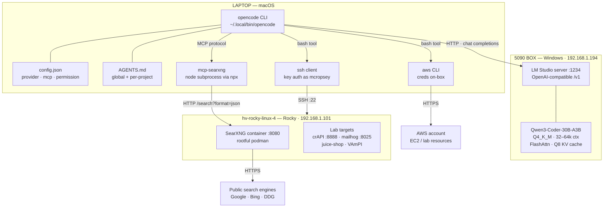
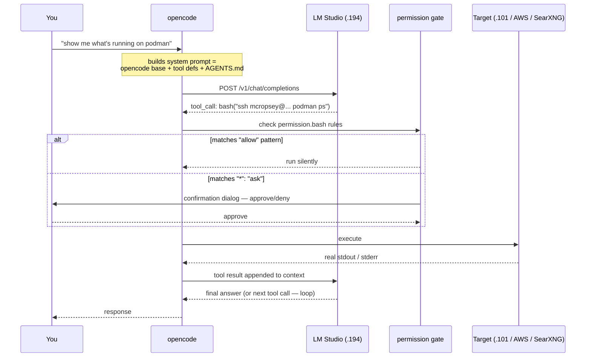
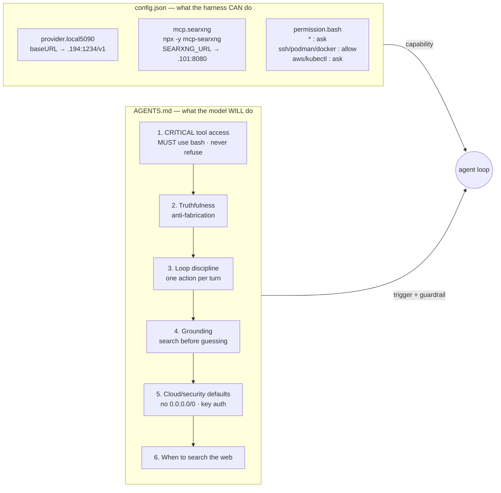
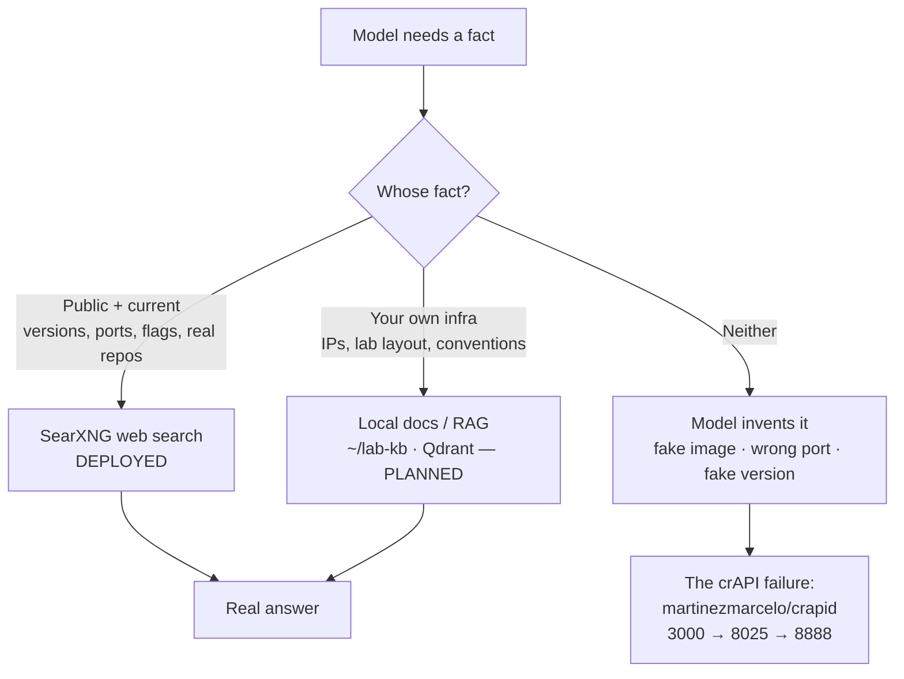

# Local Agentic Stack — Architecture Reference

Synthesized from `local-agent-setup-log.md`, `opencode-local-llm-setup.md`,
`opencode-searxng-web-search.md`, and `opencode-web-search-setup.md` (superseded).

Three physical machines, one agent loop. Everything below is on the private LAN.

---

## 1. Physical topology



### Who is who

| Component | Host | Role |
|---|---|---|
| **opencode** | Laptop | The harness. Owns the tools and the think→act→observe loop |
| **LM Studio** | 5090 · .194 | The brain. Serves the model over an OpenAI-compatible API |
| **mcp-searxng** | Laptop (subprocess) | Translates MCP tool calls → SearXNG HTTP requests |
| **SearXNG** | Rocky · .101 | Self-hosted metasearch; fans out to real engines, returns JSON |
| **Lab targets** | Rocky · .101 | Deliberately-vulnerable apps the agent operates on |
| **AGENTS.md** | Laptop | Behavioral control plane — injected into every system prompt |

> The single most useful framing from the docs: **an agent is an LLM + tools + a loop.**
> The brain and the harness live on *different machines*. Most "opencode isn't working"
> problems are model problems, not harness problems.

---

## 2. The agent loop — one turn, end to end



**Where each turn can break** (numbers map to §5):

- Prompt assembly too big for loaded context → **G3**
- Model refuses to emit the tool call at all → **G1**
- Command needs a TTY (sudo / ssh password) → **G0 / G2**
- Tool result arrives but model invents a nicer one → **G4**

---

## 3. Configuration control plane

Two files do all the work, and they do different jobs.



**Capability and trigger are separate, and you need both.** The MCP block gives the model
a search tool; only the AGENTS.md rule makes it reach for one. Same pattern for sudo: the
permission block allows it, the AGENTS.md line makes the model actually call it instead
of explaining it.

**Order inside AGENTS.md is load-bearing.** Local models weight earlier instructions more
heavily, and their built-in safety training competes with your file. As the file grows, a
tool-access block buried at the bottom loses to the safety filter — which is the documented
regression: SSH stopped working *after* the web-search section was appended.

### File location map

| File | Path | Scope | Read when |
|---|---|---|---|
| `config.json` | `~/.config/opencode/config.json` | Laptop | opencode start |
| `AGENTS.md` (global) | `~/.config/opencode/AGENTS.md` | Per-machine, does **not** follow you between boxes | Session start |
| `AGENTS.md` (project) | launch directory | Per-project | Session start |
| `settings.yml` | `/var/lib/containers/storage/volumes/<vol>/_data/` on .101 | SearXNG | Container start |

> Two naming traps the docs call out: the opencode config is **`config.json`**, not
> `opencode.json` (many guides are wrong), and the MCP schema is `mcp` / `type:"local"` /
> `command` as an **array** — not the generic `mcpServers` + `command`/`args` shape.

---

## 4. Grounding layer — why it exists



These fix *different* hallucinations and web search will never cover the second column —
your lab specifics aren't on the internet. Tavily was the original path for column one and
is now superseded by self-hosted SearXNG (no API key, no rate limit, nothing leaves the LAN).

---

## 5. Failure map — where each gotcha lives

```
LAPTOP                          NETWORK              5090 (.194)        ROCKY (.101)
──────────────────────────────  ───────────────────  ─────────────────  ──────────────────
G0  sudo needs a TTY                                 G3  8k default ctx  G2  ssh password
    → sudo -v before session                             → 32–64k, reload    → ssh-copy-id
G1  model dictates instead                           G6  empty response  G5  podman lock
    of running                                           → wrong chat        corruption
    → CRITICAL block FIRST                               template            → system renumber
G4  claims success it never
    verified
    → verification rules
```

| # | Symptom | Layer | Fix |
|---|---|---|---|
| G0 | `sudo: a terminal is required` | Harness (non-interactive bash) | `sudo -v` in your terminal first (~5 min cache) |
| G1 | "I can't access external systems, here's what to run" | **Model safety filter beating AGENTS.md** | Tool-access block first + emphatic language; per-prompt: "Use bash and SSH to…" |
| G2 | SSH hangs | Auth | Key auth via `ssh-copy-id`; must be password-free for *you* first |
| G3 | `exceeds available context size (8192)` | LM Studio load settings | Context 32–64k, FlashAttn + Q8 KV, reload |
| G4 | "The container is running" — it isn't | Model over-claiming | Verification rules; end prompts with an explicit check |
| G5 | `acquiring lock … file exists` dismissed as harmless | Podman state | `podman rm -f` → `stop --all` → `system renumber` |
| G6 | Thinks, emits nothing | Tool-call formatting | Native tool-use chat template for that GGUF |

**G1 is the recurring one** and it's architectural, not a config regression: your
instructions and the model's own training are competing for the same system prompt, and
prompt length shifts who wins.

---

## 6. Rootful vs rootless — a namespace split worth drawing

SearXNG on .101 was created with `sudo` deliberately, which means it lives in a different
storage namespace than rootless podman:

```
sudo podman ps   →  /var/lib/containers/...   →  searxng visible   ✅
     podman ps   →  ~/.local/share/containers →  empty list        ❌ (looks deleted)
```

Consequences that follow from this one choice:

- Every `podman` command for SearXNG needs `sudo` — `ps`, `exec`, `restart`, `volume inspect`
- Reboot survival needs the **system** unit: `sudo systemctl enable --now podman-restart.service`
  (podman's `--restart` flag alone does *not* replay after a host reboot, unlike Docker)
- Volume paths are predictable under `/var/lib/containers/storage/volumes/` — but always get
  the real one from `sudo podman volume inspect`, since the name varies by launch flags
- The agent needs passwordless sudo (or root SSH) to see any of it

---

## 7. Deployed vs planned

```mermaid
graph LR
    subgraph NOW["Deployed"]
        N1["LM Studio + Qwen3-Coder-30B-A3B"]
        N2["opencode + config.json"]
        N3["AGENTS.md control plane"]
        N4["SearXNG + mcp-searxng"]
        N5["SSH key auth to .101"]
        N6["AWS CLI via bash"]
    end
    subgraph NEXT["Open items"]
        P1["aws-docs MCP"]
        P2["Qdrant RAG over ~/lab-kb<br/>nomic-embed-text-v1.5"]
        P3["Frontier provider<br/>hybrid escape hatch"]
        P4["Model A/B:<br/>gpt-oss-20b vs Devstral"]
        P5["API key on :1234<br/>before any exposure"]
    end
    NOW -.-> NEXT
```



---

## 8. Discrepancies across the four docs

Worth resolving before the next fresh-machine rebuild:

| Item | Conflicting values | Current truth |
|---|---|---|
| `SEARXNG_URL` | `.194:8080` (setup log §3b) vs `.101:8080` (appendix + SearXNG guide) | **`.101:8080`** — SearXNG runs on the Rocky box |
| Config filename | `opencode.json` (Tavily doc) vs `config.json` (everywhere else) | **`config.json`** |
| MCP launcher | `uvx` (setup log §3b) vs `npx -y` (appendix + SearXNG guide) | **`npx -y`** |
| Model | `qwen3-32b` (Phase 1–2) vs `Qwen3-Coder-30B-A3B` (appendix) | **Qwen3-Coder-30B-A3B**, 64k ctx |
| Web search backend | Tavily vs SearXNG | **SearXNG** — Tavily doc is marked superseded |

---

## 9. Security boundary

```
   Trusted                    │  Semi-trusted            │  Deliberately hostile
   ───────────────────────────┼──────────────────────────┼─────────────────────────
   Laptop (creds, SSH keys)   │  LM Studio :1234         │  crAPI · juice-shop · VAmPI
   AWS account                │  (no auth — LAN only)    │  on .101
                              │  npx-fetched MCP code    │
                              │  (unpinned = supply      │
                              │   chain risk)            │
```

Three standing rules from the docs:

1. **Point the SSH-enabled agent only at the lab network.** An agent that can SSH *and*
   occasionally over-claims success should not reach anything you care about.
2. **Pin MCP/plugin versions** (`mcp-searxng@1.0.0`). `npx -y` runs unaudited code from npm
   and will silently pull newer versions.
3. **Don't expose :1234 past the LAN** while `Require Authentication` is off.

The burned credential from the Phase 3 session (`sshpass -p …`) should be treated as
compromised and rotated if it hasn't been.
